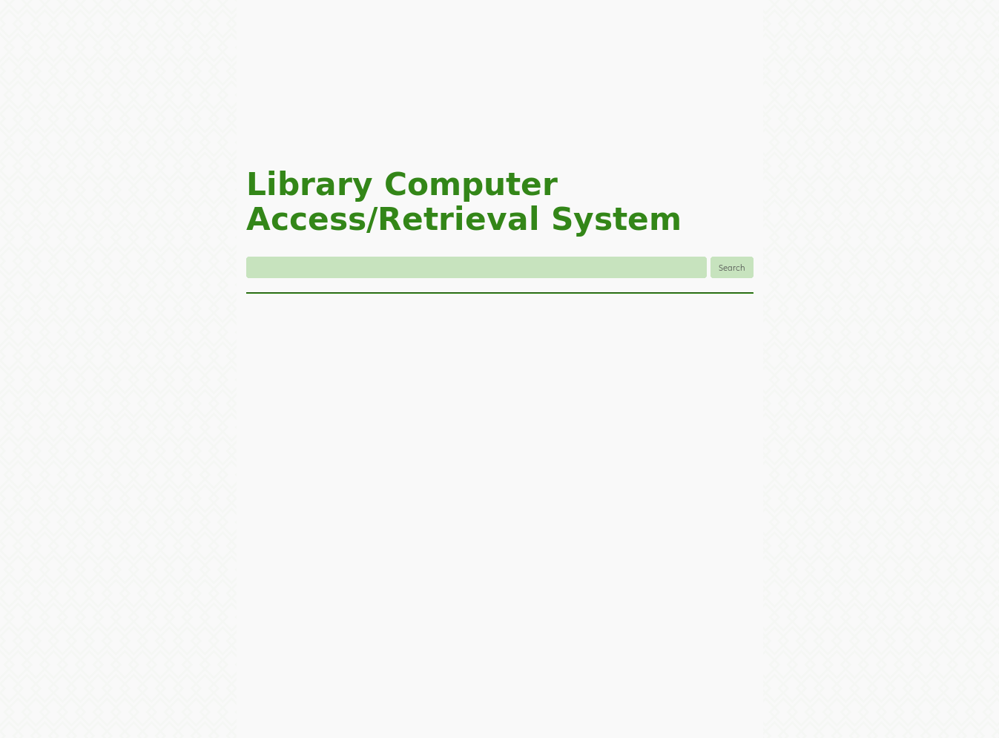
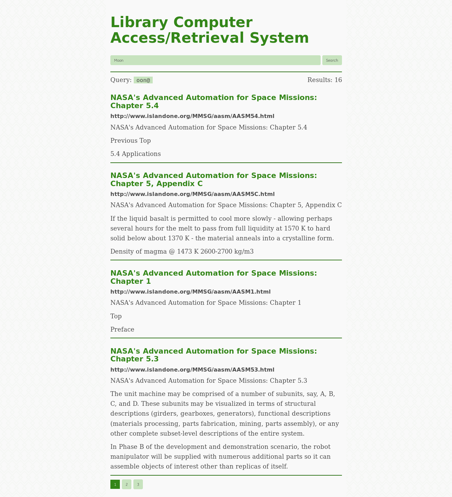

# Early pre-release
## WIP, expect breaking changes.




Simple website search using flask and sqlite's full text search. 
Originally I was going to use
OpenSemanticSearch, but I found it far too difficult to get working on armbian,
so I settled on simple text search instead.

This is intended to be the search engine for my personal archive, but it might
be a good fit for internet-in-a-box as well.

# Goals

 * Simple to set up, no need for docker, no dependencies on other services
 * Avoid duplicating data (data retrieval needs to be fast for snippets to work
     without caching)
 * Return results in under 1 second
 * Works on low-ish power/memory systems like the raspberry PI (or worse)
 * JSON(rest-ish) API
 * Expose CLI commands for all API endpoints
 * Support clustering to minimize load on embedded devices
 * Extract data from many different types of files
 * Configuration via env variables or env files, for "12factor" app
     compatibility.

We use whoosh as our search engine, and huey with the sqlite backend as a
task-queue, although it could also use redis for distributed crawling.

There are a few things that are notably absent, namely

 * Security, the /api/ endpoint is not secured. For any kind of production use
     consider securing it via your webserver configuration.
 * Fair resource utilization, there is no rate limiting and even the normal
     search page could time out if you set a high enough *limit*, getting it to
     render all the results at once.

# Alternatives

There are some more mature alternatives for intranet search that you might want
to investigate. For the most part these will have better performance but also
have higher system requirments.

 * Yacy, the "peer to peer" search engine. I found this returned much better
     results on limited intranet datasets than on the general internet. You can
     set it as an intranet search without connecting to the peer to peer
     network. Very simple to deploy. Probably the one I'd recomend the most,
     although the results page is a bit ugly.

 * OpenSemanticSearch, very powerful but hard to set up. Has facilities for
     structured data and named-entity-recognition, so it can be quite a bit more
     powerful than google for highly-linked data sets that don't use actual
     hyperlinks. Thinks like research papers or corporate ledgers. Great for
     indexing the kinds of content google traditionaly does poorly with.

 * sist2, designed for very large multimedia collections. Very fast indexing,
     but you need to feed it files not web pages. Created for the-eye-dot-eu, a
     large public archive of mostly pdfs and epubs.

# Technology

We use textract to extract text from more complicated dataformats, you can
see how that works
[here](https://textract.readthedocs.io/en/stable/#currently-supporting).

# Usage

## Quickstart

```bash
pip3 install --user pipx
python3 -m pipx ensurepath
pipx install git+https://github.com/traverseda/iiab-searchServices.git --force
lcars-tasks & #Run tasks in the background
lcars-server & #Run web server in the background
lcars-cli index http://someurl
```

## Development

I will try to be pretty responsive, so if you have any questions feel free to
open an issue, it's not just for bug/feature-requests.

If you're writing a new app you can integrate with the api to update indexes.
Otherwise you probably want to use things like cron (timers) and incron (run
command when files change) and the command line interface.

# Developing

ToDo: documentation on how to extend this with custom data extractors
ToDo: Allow removing urls that no longer exist (and all their descendents)
